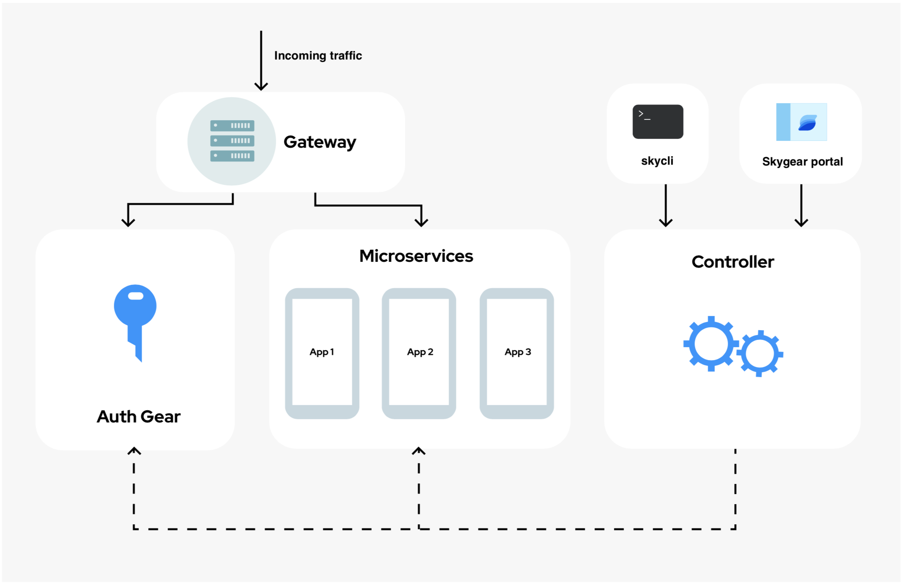

# Skygear Documentation

Skygear is a server-less cloud platform where a massive portion of set up, operation and configuration tasks are abstracted from Kubernetes. It is still Kuberentes-based, however instead of having to write a bunch of configuration files and manually enable various options on a k8s cluster before an app can be deployed, all you need to do on Skygear is write  one single configuration file `skygear.yaml`.

Configurations of an app such as port number, environment variables and some Skygear hooks are defined in `skygear.yaml`, which is interpreted and executed by Skygear upon deployment.

Below is an architecture diagram of Skygear, which can be divided into 4 main parts:

**Gateway**

All incoming requests attempting to reach a user's **Microservices** or **Auth Gear** must always go through Skygear's **Gateway**. Handling on mechanisms like refresh tokens and Cross-Origin Resource Sharing \(CORS\) takes place here, before request hits its destination. 

App-level user information \(users of the applications\) is also resolved here, where the **Gateway** asks **Auth Gear** to authenticate app-level user credentials provided in a request and insert the corresponding access token into the request's header upon authentication success. The  request will then be routed to its destination, which now have access to the app-level user information via the newly added access token.

**Microservices** 

This is where a user's applications are hosted and run. Since Skygear rides on a Kubernetes cluster which is container-based, apps uploaded must go through a containerization process before they are actually deployed and run as container instances. A user will have to define instructions on the containerization process, via either of the following three ways:

1. Opt for a pre-configured template. Skygear offers a list of containerization templates where a user can specify one at their `skygear.yaml`.
2. Write a `Dockerfile`and upload it with `skygear.yaml` and the app's source code. Skygear will build the container image based on it.
3. Skip containerization by point to a pre-built image. If such image is stored on a private registry, the user can provide credentials via Skygear secrets.

With the application code, `skygear.yaml`, and `Dockerfile` \(if any\) ready, a deployment can be triggered with Skygear's command line interface `skycli` .

**Auth Gear**

A complete and secure authentication solution that has gone through rounds of security audits. We developers at Oursky believe an authentication backend service is hard to be done right, at the same time such service is frequently a requirement from our clients. As a result, `Auth Gear` is developed and shipped with Skygear, in response to such pain points and provide a reusable solution.

A user's frontend can interact with **Auth Gear** through Skygear's SDKs, whilst his/her backend applications  in the **Microservices** part can achieve same things with the access token resolved and inserted in requests by the **Gateway**.

**Controller**

Skygear controller is responsible for app deployments and manages the behaviours and desired states of **Auth Gear** and **Microservices**. There are two means to manipulate them. The first one is `skycli`, where the user can not only trigger app deployments, but also customise how ****his/her **Auth Gear** and **Microservices** works. The other one is `Skygear Portal`, a web-based Graphical User Interface \(GUI\) allowing the user to define behaviours through a variety of intuitive UI components. 

