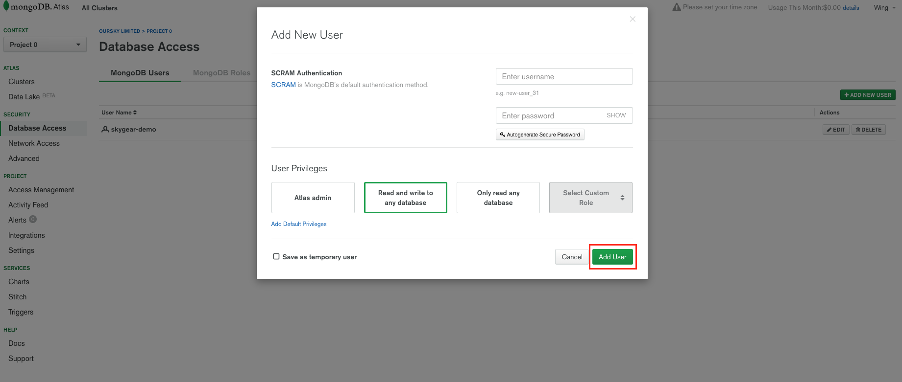
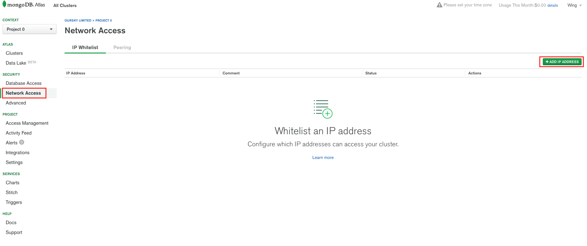
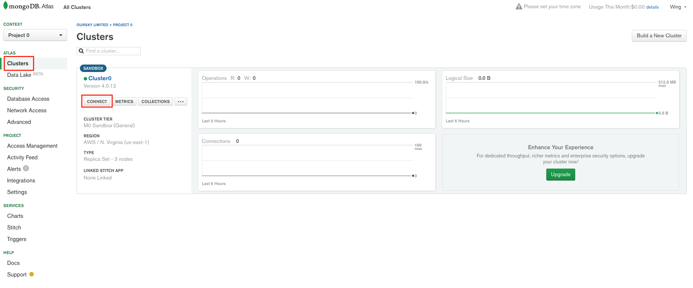
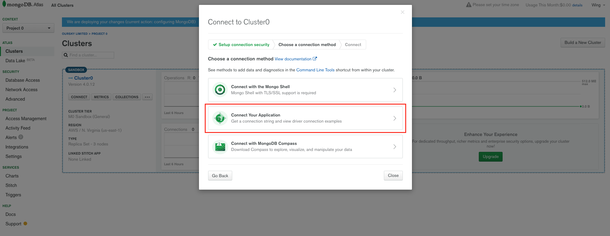
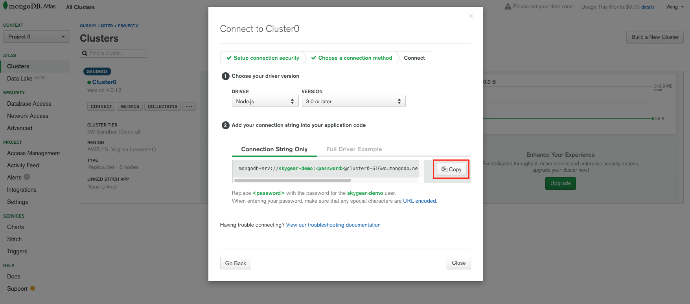
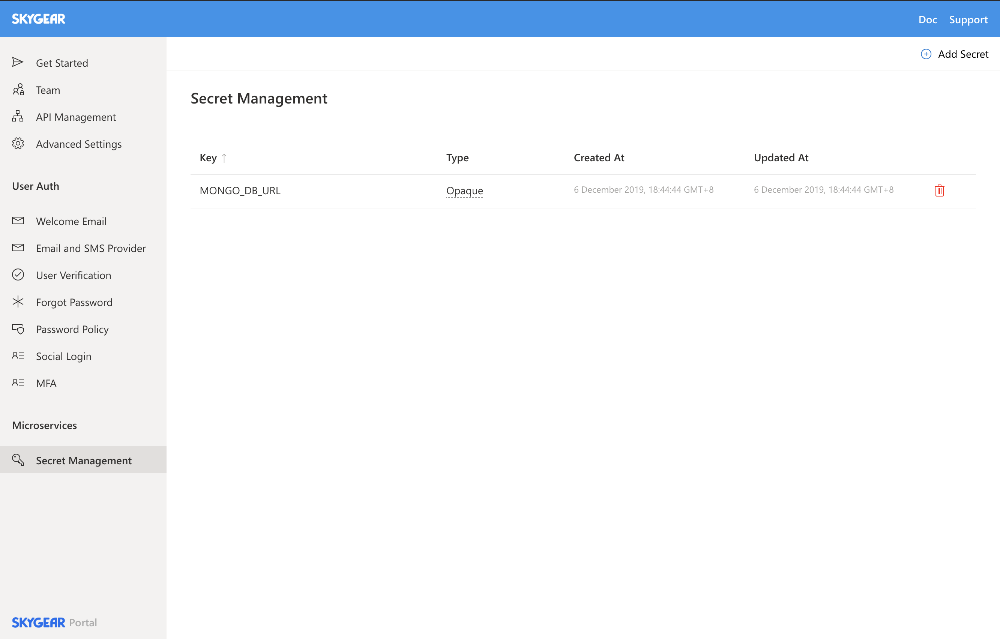

# How to connect to a managed database on Skygear

## Introduction

An database is often an essential to frontend apps. Skygear doesn't come with an out-of-the-box database, however it's almost effortless to bring in one of yours.

While it's perfectly fine to read this _How to_ section as a standalone guide, to grasp the whole picture you are recommended to go through this [_Quick Start_ ](../quick-started/integrate-with-frontend.md).

There exist numerous managed database services out there, and we will use MongoDB Atlas as our sample in this section. Connection will be established through MongoDB Atlas's _Connection String_.

## Prerequisites

Have a Skygear account and an app registered. We will be using Secret on Skygear, which is a resource designed to hold sensitive information, registered under and can used by a Skygear app. The latter part of this definition means you will need an app before you can add Secrets.

Before you start this section, please ensure you have `skycli` installed and configured properly.

Although this section doesn't really require `skycli` as we will be adding database connection via Secrets which can be done with Skygear Portal, to try out the newly connected database you will still need an app deployed and `skycli` is the only way to perform that. 

**TL**;**DR** Sooner or later you will need to install and configure `skycli`.

## Sign up to MongoDB Atlas

Navigate to [here](https://www.mongodb.com/download-center) and fill in the create account form. Finish the registration flow and choose options as you fancy. They offer a free managed database cluster, still you can opt for the more decorated ones.

Once you have signed up and are redirected to your Atlas dashboard, click on the "Database Access" link on the left sidebar. Add a new user to your MongoDB Atlas cluster in that page, and be sure to jot down the username and password pair as we will need these later.



Then go to the "Network Access" page, whose link is just under "Database Access" on the left sidebar. You should find an add-ip-address button, click on it and choose the option "Allow Access from Anywhere" in the popped up form. Don't forget to click "Confirm" to finalise your configurations!



Go back to "Cluster" on the left sidebar, and click the grey button "Connect".



Choose the option “Connect Your Application” ****.



And save the connection string. Be sure to replace the placeholders in the string with your credentials jotted down earlier.



## Save the Connection String as a Secret on Skygear

You have two options:

### skycli

Create a secret with the database connection information using `skycli`:

```bash
$ skycli secret create <secret_name> '<database_url>'

#example
$ skycli secret create MONGO_DB_URL 'mongodb+srv://<USER>:<PASSWORD>@<HOST>/<COL>?retryWrites=true'
```

To check if the Secret has been created successfully:

```text
$ skycli secret list
NAME           CREATED_AT                  
MONGO_DB_URL   2019-10-10 14:03:40 +08:00 
```

### Skygear Portal

Create a secret on Skygear Portal. Below is a screenshot where a Secret has been added:



## Pass in the Connection String to service\(s\)

Say you have written some code that are deployment-ready called `backend`. To access a Secret, i.e. your MongoDB Atlas connection string in `backend`named `MONGO_DB_URL`,  update `skygear.yaml`:

```
app: <your_app_name>

deployments:
  backend:
    environment:
    - name: MONGO_DB_URL         #name of env variable
      secret: MONGO_DB_URL       #the actual Secret value
    type: http-service
    context: <your_code_path>    #where you code resides
    path: <service_path>         #where the service is exposed         
    port: 8080                   #where the service is exposed         
```

Say you are coding in Node.js. To access the Connection String:

```javascript
const connectionString = process.env.MONGO_DB_URL;
// do something with connectionString...
```

## Deploy app to apply changes

```text
$ skycli app deploy
```

